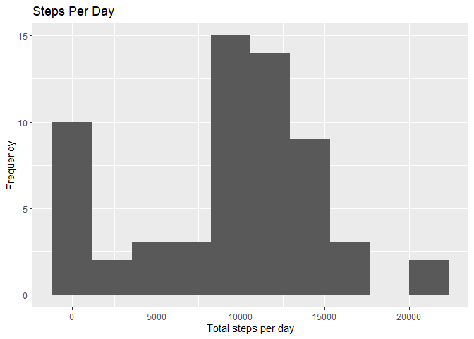
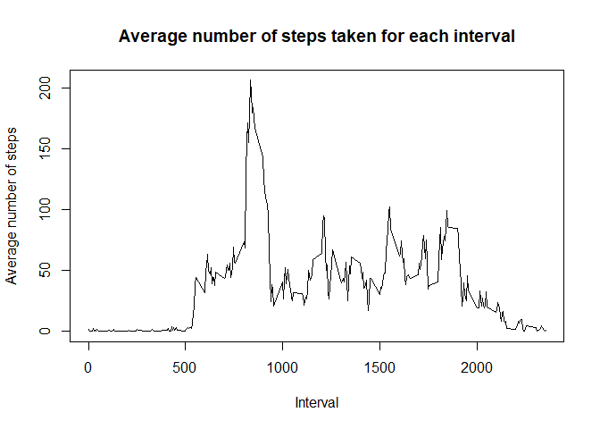
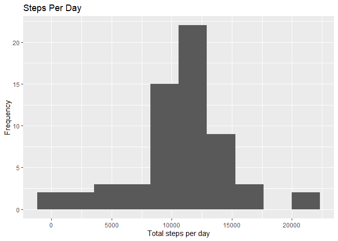
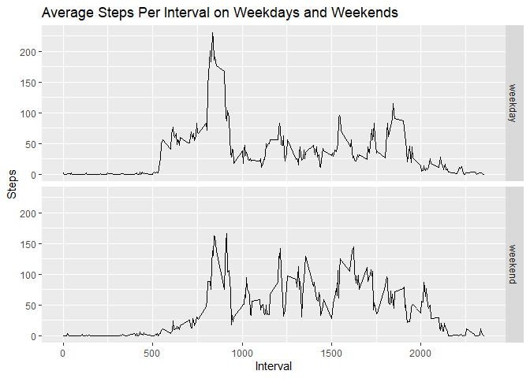

## Loading and preprocessing the data
Load needed libraries

```r
library(dplyr)
```

```
## 
## Attaching package: 'dplyr'
```

```
## The following objects are masked from 'package:stats':
## 
##     filter, lag
```

```
## The following objects are masked from 'package:base':
## 
##     intersect, setdiff, setequal, union
```

```r
library(ggplot2)
```

1. Load the data  

Read the data from the zip file

```r
activity <- read.csv(unz("activity.zip", "activity.csv"))
```

2. Process/transform the data (if necessary) into a format suitable for your analysis  

convert date strings to date objects

```r
activity$date <- strptime(activity$date, "%Y-%m-%d")
```

## What is mean total number of steps taken per day?
1. Calculate the total number of steps taken per day  

Ignore NA values

```r
totalDay <- activity %>% group_by(date) %>% summarise(sum = sum(steps, na.rm = TRUE))
```

2. Make a histogram of the total number of steps taken each day

```r
ggplot(totalDay, aes(x = sum)) +
  geom_histogram(bins = 10) + 
  labs(title = "Steps Per Day",
       x = "Total steps per day",
       y = "Frequency")
```

<!-- -->

3. Calculate and report the mean and median of the total number of steps taken per day  

Mean

```r
cat("Mean:", mean(totalDay$sum, na.rm = TRUE))
```

```
## Mean: 9354.23
```
Median

```r
cat("Median:", median(totalDay$sum, na.rm = TRUE))
```

```
## Median: 10395
```

## What is the average daily activity pattern?
1. Make a time series plot (i.e. type = "l") of the 5-minute interval (x-axis) and 
the average number of steps taken, averaged across all days (y-axis)

```r
intervalAvg <- activity %>% group_by(interval) %>% summarise(mean = mean(steps, na.rm = TRUE))
plot(x = intervalAvg$interval,
     y = intervalAvg$mean,
     type = "l",
     xlab = "Interval",
     ylab = "Average number of steps",
     main = "Average number of steps taken for each interval")
```

<!-- -->

2. Which 5-minute interval, on average across all the days in the dataset, contains the maximum number of steps?

```r
max <- intervalAvg$interval[which.max(intervalAvg$mean)]
cat("Max interval:", max)
```

```
## Max interval: 835
```

## Imputing missing values
1. Calculate and report the total number of missing values in the dataset (i.e. the total 
number of rows with NAs

```r
sum(is.na(activity))
```

```
## [1] 2304
```

2. Devise a strategy for filling in all of the missing values in the dataset. The strategy does 
not need to be sophisticated. For example, you could use the mean/median for that day, or the 
mean for that 5-minute interval, etc.

Replace NAs with mean of that 5 minute interval.

3. Create a new dataset that is equal to the original dataset but with the missing data filled in.  

Create new dataset using previously calculated interval means to fill in NA values.

```r
activity2 <- activity
for (i in 1:nrow(activity2)) {
  if (is.na(activity2[i,'steps'])) {
    activity2[i,'steps'] <- filter(intervalAvg, interval == activity2[i,'interval'])$mean
  }
}
```

4. Make a histogram of the total number of steps taken each day and Calculate and report the mean and median total number of steps taken per day. Do these values differ from the estimates from the first part of the assignment? What is the impact of imputing missing data on the estimates of the total daily number of steps?  

Calculate and create histogram for total steps per day.

```r
totalDay2 <- activity2 %>% group_by(date) %>% summarise(sum = sum(steps))
ggplot(totalDay2, aes(x = sum)) +
  geom_histogram(bins = 10) + 
  labs(title = "Steps Per Day",
       x = "Total steps per day",
       y = "Frequency")
```

<!-- -->

Calculate and report mean and median.

```r
cat("Mean:", mean(totalDay2$sum))
```

```
## Mean: 10766.19
```

```r
cat("Median:", median(totalDay2$sum))
```

```
## Median: 10766.19
```

Imputing missing data has a noticeable impact on our estimates. The shape of the histogram as well
as the median and mean are different. Using a different method of filling in missing values may
cause different results.

## Are there differences in activity patterns between weekdays and weekends?
1. Create a new factor variable in the dataset with two levels – “weekday” and “weekend” 
indicating whether a given date is a weekday or weekend day.  

Create weekday and weekend variables based on day of week.

```r
activity2$day <- ifelse(weekdays(activity2$date) == "Saturday" | 
                          weekdays(activity2$date) == "Sunday",
                        "weekend",
                        "weekday")
```

2. Make a panel plot containing a time series plot (i.e. type = "l") of the 5-minute interval (x-axis) 
and the average number of steps taken, averaged across all weekday days or weekend days (y-axis). See 
the README file in the GitHub repository to see an example of what this plot should look like using 
simulated data.  

Calculate mean per interval and weekday/weekend

```r
intervalDay <- activity2 %>% group_by(interval, day) %>% summarise(mean = mean(steps))
```

```
## `summarise()` has grouped output by 'interval'. You can override using the `.groups` argument.
```

Plot

```r
ggplot(intervalDay, aes(interval, mean)) + 
  geom_line() + 
  facet_grid(day ~ .) + 
  labs(title = "Average Steps Per Interval on Weekdays and Weekends",
       x = "Interval",
       y = "Steps")
```

<!-- -->
